# Apple Networking & Cloud Infrastructure Analysis

### Findings from `Logs/AdminLogs.log`


> **Scope:** This report summarizes direct observations and technical interpretation from the supplied macOS Unified Logging snapshot. It focuses on Apple networking, Akamai/CDN activity, iCloud Private Relay, Daiquiri response metadata, AWS/Kubernetes backend identifiers, and QUIC-related proxy behavior.

---

## Table of Contents

- [Overview](#overview)
- [Executive Summary](#executive-summary)
- [Overall Architecture](#overall-architecture)
- [Apple Content Delivery Network (CDN)](#apple-content-delivery-network-cdn)
- [Apple Private Relay](#apple-private-relay)
- [Private Relay Topology](#private-relay-topology)
- [Akamai Token Infrastructure](#akamai-token-infrastructure)
- [QUIC / HTTP/3](#quic--http3)
- [Daiquiri Backend](#daiquiri-backend)
- [Hybrid Cloud Architecture](#hybrid-cloud-architecture)
- [Apple Services Observed](#apple-services-observed)
- [DNS Resolution](#dns-resolution)
- [Cloud Providers Observed](#cloud-providers-observed)
- [Technical Findings](#technical-findings)
- [Conclusions](#conclusions)
- [Evidence Handling](#evidence-handling)

---

## Overview

This document summarizes observations from `Logs/AdminLogs.log`, a macOS Unified Logging snapshot containing approximately four minutes of networking activity.

The log is primarily composed of:

- DNS resolution
- Apple service communication
- Content Delivery Network (CDN) routing
- iCloud Private Relay configuration
- Apple backend service metadata
- HTTP response headers
- `Network.framework` events

Rather than functioning primarily as a record of administrator actions, the supplied excerpt provides a detailed look at how macOS communicates with Apple's cloud and delivery infrastructure.

---

## Executive Summary

The logs reveal multiple layers of Apple's production networking architecture operating simultaneously.

Observed infrastructure includes:

- Apple CDN services
- Akamai edge infrastructure
- Apple Private Relay
- Cloudflare relay infrastructure
- Fastly relay infrastructure
- Apple's `Daiquiri` backend
- AWS-hosted Apple service-instance identifiers
- Kubernetes-hosted Apple service-instance identifiers
- QUIC / HTTP/3 proxy routing
- Privacy token authentication
- Apple News
- App Store services
- Apple Account Services

One of the most interesting observations is that Apple backend responses returned headers containing internal-looking routing and instance metadata.

> **Apple’s 2022 backend was exposing a fairly detailed hybrid cloud architecture through HTTP response headers, with Daiquiri fronting Kubernetes-hosted and AWS-hosted production service instances while macOS simultaneously maintained an Apple → Akamai/Cloudflare/Fastly privacy-relay architecture.**

### Direct observation vs. interpretation

| Type | Finding |
|---|---|
| **Direct observation** | HTTP responses identify `daiquiri/3.0.0`. |
| **Direct observation** | `x-daiquiri-instance` contains both `...kubernetes...` and `...aws...` identifiers. |
| **Direct observation** | Akamai cache infrastructure appears in `x-cache` and DNS resolution paths. |
| **Direct observation** | `networkserviceproxy` logs Akamai token generation, activation, caching, and QUIC token activity. |
| **Direct observation** | Private Relay configuration names Apple, Akamai, Cloudflare, and Fastly-related endpoints. |
| **Interpretation** | The combined evidence is consistent with a hybrid Apple backend and multi-provider privacy/CDN architecture. |

---

## Overall Architecture

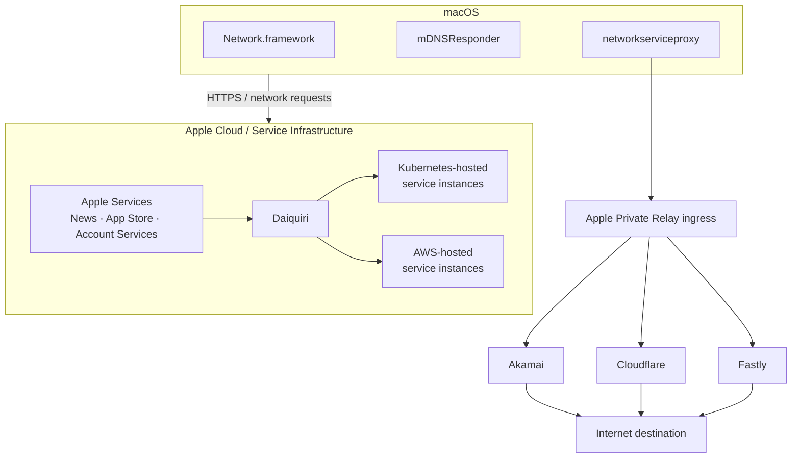

This diagram combines two distinct classes of observations:

1. Apple service responses exposing Daiquiri/backend instance metadata.
2. Local privacy-proxy configuration exposing Apple ingress and third-party relay providers.

---

## Apple Content Delivery Network (CDN)

A significant portion of the log consists of DNS resolution involving Apple's CDN paths and Akamai edge infrastructure.

A representative resolution path is:

```text
init.itunes.apple.com
        │
        ▼
init-cdn.itunes-apple.com.akadns.net
        │
        ▼
itunes.apple.com.edgekey.net
        │
        ▼
e673.dsce9.akamaiedge.net
        │
        ▼
Akamai edge IP
```

Conceptually:

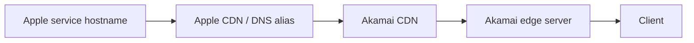

This is consistent with Apple's use of Akamai's globally distributed edge infrastructure to serve content efficiently.

### Key Observation

Apple service delivery in the log is not limited to direct Apple-owned endpoints. DNS aliases and response metadata show Akamai participating in the delivery path.

> **Apple → Akamai CDN → an Akamai edge server geographically/routing optimized for the client ISP connection.**

That model explains why the log can contain a very large number of Akamai references without each reference representing an unrelated external service.

### Raw evidence: Akamai cache + Daiquiri response metadata

The following panel is rendered from exact lines in `AdminLogs.log`. It shows an Akamai cache hit together with the Daiquiri server and instance headers returned in the same response block.

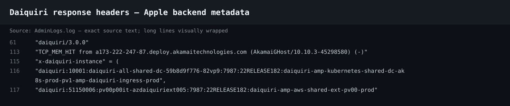

**Observed directly:**

- `daiquiri/3.0.0`
- `AkamaiGHost`
- an Akamai Technologies cache hostname
- `x-daiquiri-instance`
- a Kubernetes-labelled Daiquiri instance identifier
- an AWS-labelled Daiquiri instance identifier

---

## Apple Private Relay

One of the clearest infrastructure disclosures in the log is the configuration processed by macOS `networkserviceproxy`.

Observed domains include:

```text
mask.icloud.com
mask-api.icloud.com
mask-h2.icloud.com
```

The configuration also includes:

```text
enabled = 1;
```

and identifies Apple plus several third-party relay/CDN providers.

### Raw evidence: Private Relay configuration

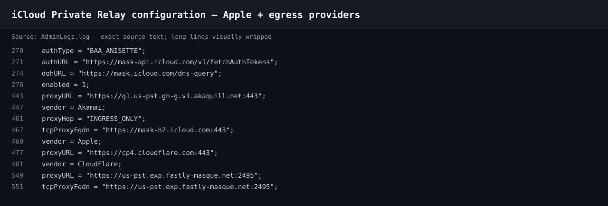

The excerpt directly shows:

- `authType = "BAA_ANISETTE"`
- `https://mask-api.icloud.com/v1/fetchAuthTokens`
- `https://mask.icloud.com/dns-query`
- `enabled = 1`
- an Akamai endpoint under `akaquill.net`
- `vendor = Akamai`
- `proxyHop = "INGRESS_ONLY"`
- `https://mask-h2.icloud.com:443`
- `vendor = Apple`
- `https://cp4.cloudflare.com:443`
- `vendor = CloudFlare`
- Fastly MASQUE-related hostnames

These are direct log observations. The architecture diagram below is the interpretation built from those records.

---

## Private Relay Topology

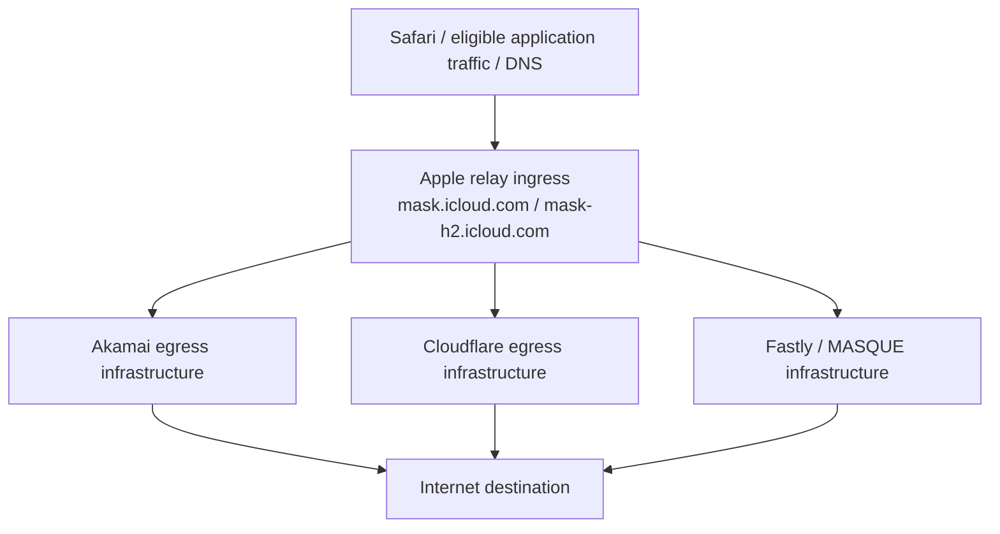

The log therefore exposes both the Apple-operated ingress side and multiple provider-specific paths associated with relay delivery.

---

## Akamai Token Infrastructure

One of the most unusual-looking sections of the log involves Akamai-specific token handling by `networkserviceproxy`.

Examples include:

```text
Registering Akamai token agent
generated 30 unactivated tokens for Akamai
Token for Quic[Akamai] fetch failed
activated 30 tokens for Akamai
Token fetch successful for "Akamai"
Cache 30 tokens for proxy "Akamai"
```

### Raw evidence: Akamai token sequence

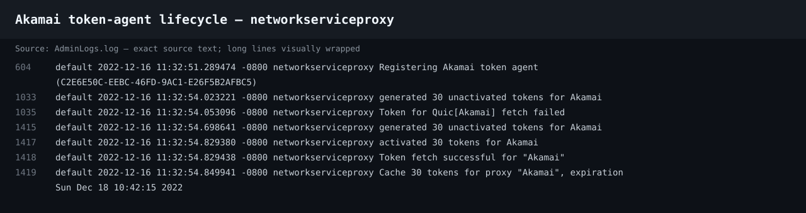

The timing is especially useful because the excerpt shows failure and recovery within the same short sequence.

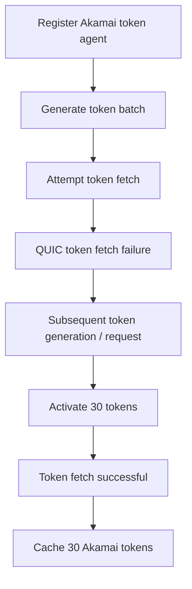

The available context is consistent with these tokens being associated with Apple's privacy-proxy routing/authentication infrastructure rather than ordinary CDN object authentication.

Importantly, the isolated failure message is followed by successful token activation and caching, so the failure should be interpreted together with the subsequent recovery events.

---

## QUIC / HTTP/3

The log explicitly references:

```text
Token for Quic[Akamai]
```

along with proxy-selection activity involving Akamai.

QUIC is the transport foundation used by HTTP/3 and is also relevant to modern proxying and MASQUE-style architectures.

A conceptual flow consistent with the log is:

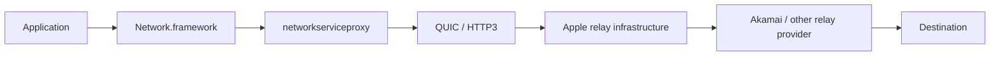

The graph is an architectural interpretation; the Akamai QUIC-token messages themselves are directly present in the evidence panel above.

---

## Daiquiri Backend

One of the most revealing response blocks identifies Apple's backend server as:

```text
daiquiri/3.0.0
```

The same response contains:

```text
x-daiquiri-instance
```

with instance identifiers that include both:

```text
daiquiri-amp-kubernetes-shared-...
```

and:

```text
daiquiri-amp-aws-shared-...
```

### Raw evidence: Daiquiri hybrid backend identifiers


The important finding is the coexistence of these labels in a response returned through an Apple service path. The log itself exposes the strings; describing them as backend routing/instance metadata is an interpretation based on their placement in the `x-daiquiri-instance` header.

---

## Hybrid Cloud Architecture

The response metadata can be modeled as:

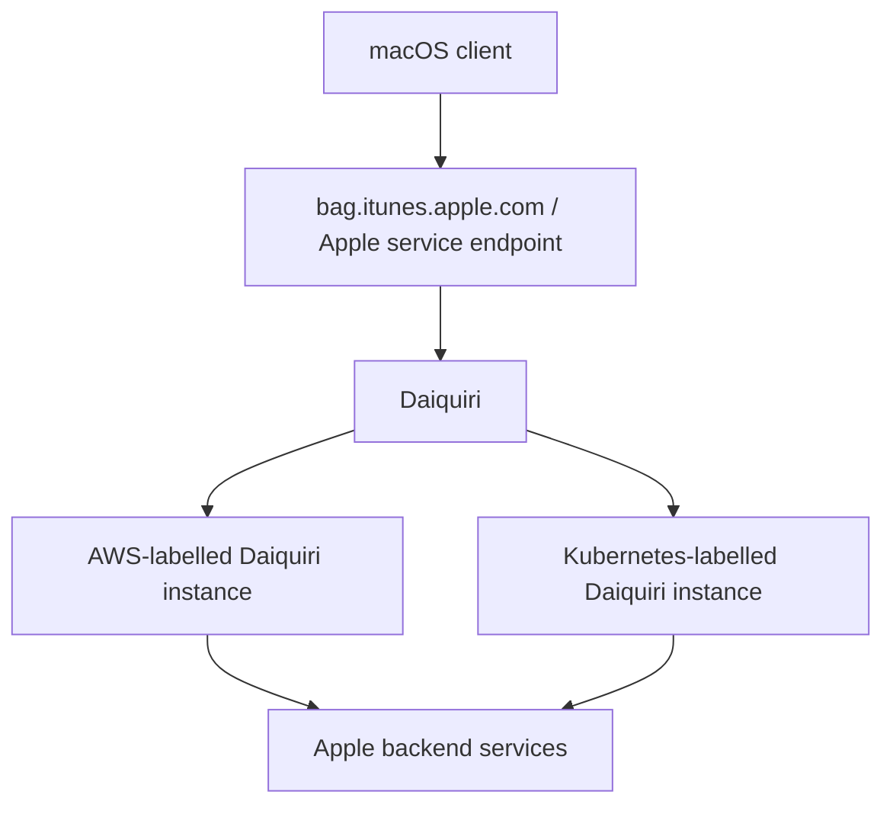

This graph intentionally treats AWS-labelled and Kubernetes-labelled instances as **parallel observations**, not as proof that one necessarily runs inside the other.

The log demonstrates that both labels were returned in the backend instance metadata. Determining the precise provider/runtime nesting would require additional infrastructure evidence beyond this snapshot.

---

## Apple Services Observed

The supplied log contains activity associated with Apple service families including:

- Apple News
- App Store
- Account Services
- Advertising/privacy services
- Apple Maps/location-service configuration
- Apple CDN infrastructure
- Apple Private Relay
- Apple Media Services
- Network.framework

Representative process/service names visible in the larger log include:

```text
mDNSResponder
networkserviceproxy
NewsToday2
adprivacyd
askpermissiond
amsaccountsd
appstoreagent
promotedcontentd
```

---

## DNS Resolution

A single user-visible service request can create many Unified Log records because DNS resolution is iterative and heavily instrumented.

Typical flow:

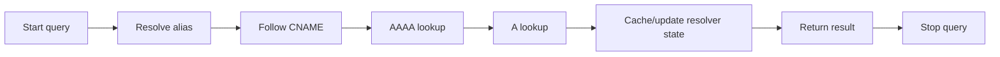

This helps explain why a relatively short capture window can contain a very large number of Akamai-related entries.

---

## Cloud Providers Observed

The log exposes two related but distinct infrastructure patterns.

### 1. Privacy / relay infrastructure

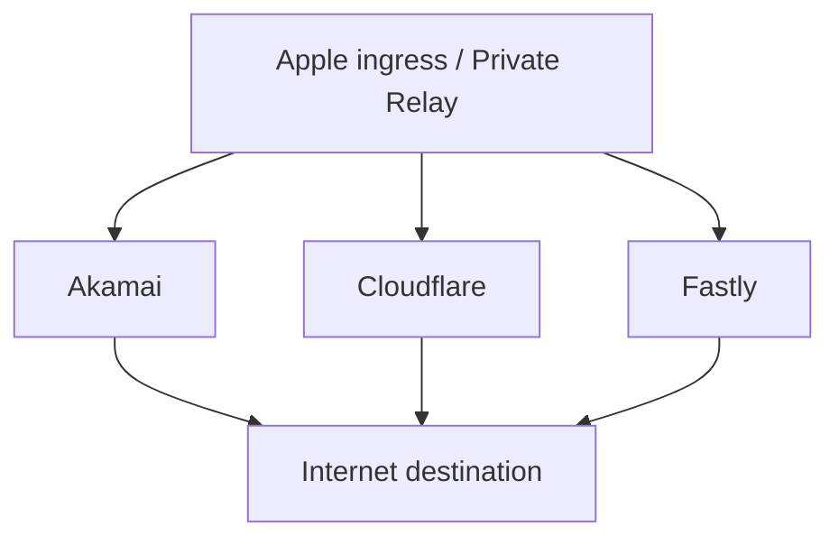

### 2. Apple application/backend metadata

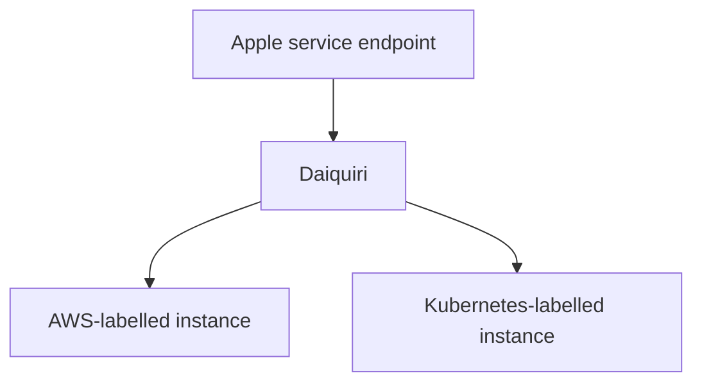

These findings show multiple infrastructure vendors and execution environments appearing in the same short macOS networking snapshot.

They do **not** by themselves establish the exact contractual, physical, or virtualization relationship between every provider. What the evidence directly establishes is that these provider/environment identifiers are present in client-visible configuration and response metadata.

---

## Technical Findings

### Apple CDN / Akamai

- Extensive Akamai edge and DNS routing appears in the log.
- Apple hostnames resolve through Akamai-related aliases and edge infrastructure.
- Response metadata includes `AkamaiGHost` and an Akamai Technologies cache hostname.
- Geographic/network-topology edge selection is consistent with standard CDN operation.

### Private Relay

Observed in the configuration:

- Apple ingress-related endpoints
- Akamai provider path
- Cloudflare provider path
- Fastly/MASQUE-related path
- token authentication endpoint
- DNS-over-HTTPS bootstrap resolver
- `enabled = 1`
- QUIC-related token activity

### Akamai Tokens

Observed lifecycle:

- token-agent registration
- token generation
- QUIC token fetch failure
- later token activation
- successful fetch
- caching of 30 Akamai tokens

### Daiquiri

Observed:

- `Server: daiquiri/3.0.0`
- `x-daiquiri-instance`
- detailed instance identifiers
- Kubernetes-labelled backend metadata
- AWS-labelled backend metadata

### Cloud Infrastructure

The log contains direct references associated with:

- Apple
- Akamai
- AWS
- Kubernetes
- Cloudflare
- Fastly

---

## Conclusions

The log provides a detailed snapshot of Apple's production networking ecosystem as it was exposed to a macOS client in December 2022.

Major observations include:

- Apple's extensive use of Akamai in CDN and edge-delivery paths.
- A multi-provider Private Relay configuration containing Apple, Akamai, Cloudflare, and Fastly-related infrastructure.
- Akamai-specific privacy/proxy token generation, QUIC token handling, activation, and caching inside `networkserviceproxy`.
- HTTP response headers exposing Apple's `Daiquiri` server identifier and detailed `x-daiquiri-instance` metadata.
- Backend identifiers referencing both AWS-labelled and Kubernetes-labelled production service instances.
- QUIC/HTTP3-related proxy behavior.

Taken together, the logs illustrate a distributed architecture combining Apple-operated services with multiple commercial infrastructure providers and backend environments.

The strongest concise finding is:

> **Apple’s 2022 backend was exposing a fairly detailed hybrid cloud architecture through HTTP response headers, with Daiquiri fronting Kubernetes-hosted and AWS-hosted production service instances while macOS simultaneously maintained an Apple → Akamai/Cloudflare/Fastly privacy-relay architecture.**

Rather than showing isolated systems, the snapshot demonstrates how client networking, relay infrastructure, CDN providers, and Apple backend service platforms appeared together within a single macOS logging window.

---

## Evidence Handling

This repository separates **direct observation** from **interpretation** wherever possible.

### Direct observation

Items copied directly from the supplied logs include:

- hostnames
- process names
- HTTP response-header values
- proxy provider names
- timestamps
- token lifecycle messages
- Daiquiri instance identifiers

### Interpretation

Architecture diagrams and descriptions connect those observations into likely service relationships. These diagrams should not be treated as internal Apple design documentation.

For reproducible analysis, readers should compare each interpretation against the original source log:

[`Logs/AdminLogs.log`](Logs/AdminLogs.log)

### Evidence panels

The inline evidence panels are SVG renderings of exact source lines from `AdminLogs.log`; long lines are visually wrapped for readability. They are stored in:

```text
evidence/
├── akamai-token-sequence.svg
├── daiquiri-hybrid-backend.svg
└── private-relay-configuration.svg
```

---

## Repository

Source log and related macOS research:

**`hideouts-io/MacOS`**
